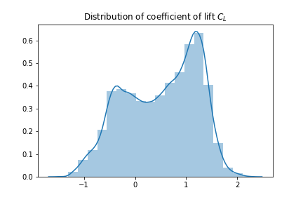
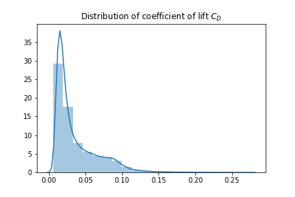
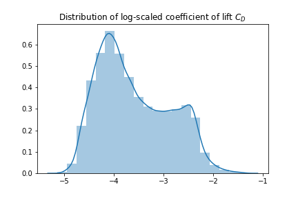
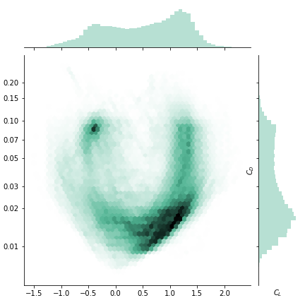
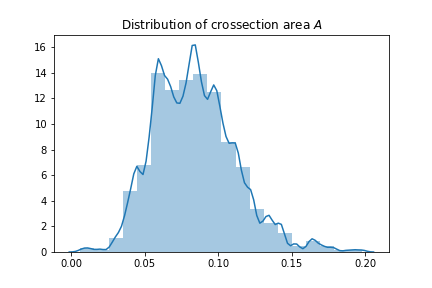
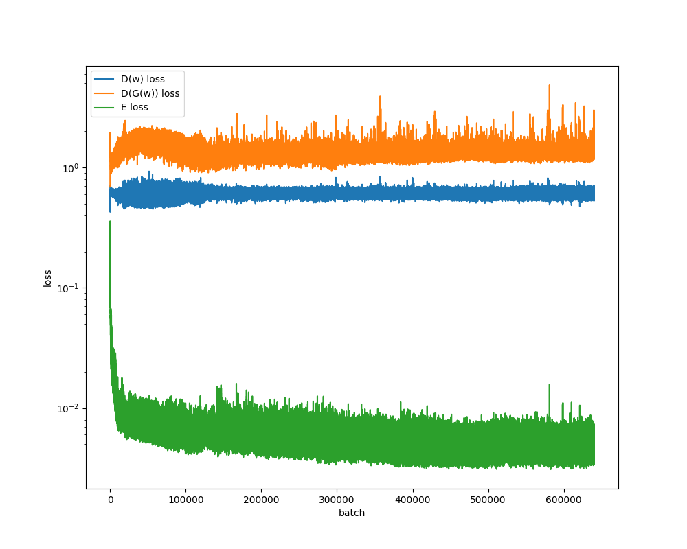
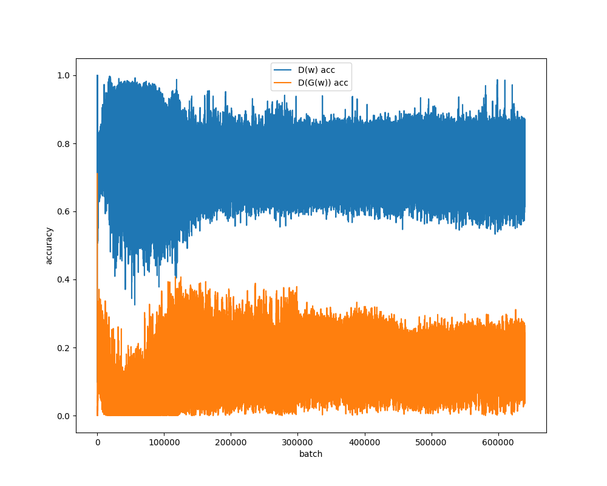
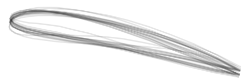

# Airfoil-GAN

Generative Adverserial Nets (GANs) have shown a promising application for generating new data samples based on large, highly varying datasets that are indistinguishable from the original real samples. Although the application has been primarily focused on visual data, such as faces or handwritten characters, the utilization of these methods for industrial applications has been somewhat limited.

Here the application of a variable auto-encoder (VAE) combined with a C-GAN is explored for the design of new 2D airfoil geometries, where the input parameters will be based on lift and drag coefficients, as well as an intended cross-sectional area.

# Literature

Two papers explore this topic in a similar fashion to the above outlined approach. Chen et al. look at the description of airfoils, by reducing the degrees of freedom of the airfoil shape, by describing the shape through splines, NURBS or Bezier curves within a Info-GAN architecture. By this approach smooth airfoil surfaces can be created, effectively removing any post-processing requirements to translate the GAN output to CFD input.

Achour et al. apply a C-GAN architecture to 2D airfoils. Specifically the focus of the study is to train the GAN model to input lift-to-drag ratios as well as the cross-sectional area. The airfoil description is based on the thickness and mean camber-lines, thereby simplifying the geometries, while also effectively suppressing negative thicknesses. Finally a Savitzky–Golay filter is applied to the generator output to smoothen the surfaces.

[1. Chen, W., Chiu, K. and Fuge, M., 2019. Aerodynamic design optimization and shape exploration using generative adversarial networks. In AIAA Scitech 2019 Forum (p. 2351).](https://doi.org/10.2514/6.2019-2351)

[2. Achour, G., Sung, W.J., Pinon-Fischer, O.J. and Mavris, D.N., 2020. Development of a Conditional Generative Adversarial Network for Airfoil Shape Optimization. In AIAA Scitech 2020 Forum (p. 2261).](https://doi.org/10.2514/6.2020-2261)

# Data Scraping

The input data to train the above GAN architecture is derived from [Airfoil Tools](http://airfoiltools.com/). About 1600 airfoil shapes were scraped, and their respective cross-sectional area calculated. Next to the shapes simulation results (CD and CL) were scraped for various angles of attacks. Specifically the case of Reynolds numbers at 200,000 were used.

The profiles were preprocessed to aid the training of the model. The following steps were implemented:

1. normalized to chord length of 1
1. used cosine spacing to refine the LE
1. Used the `Selig` profile formatting, interpolated to specified number of points (32 points considered further)
1. limited to airfoils with area smaller 0.2
1. supplying CL, CD and area as parameters

Scraping was done in parallel using `ray` on 20 CPUs.

# Data Exploration

The coefficient of lift shows a roughly bi-modal normal distribution, as seen below.  

The coefficient of drag shows a Weibull-like distribution, limited by positive values only. For GAN performance, a close-to-normal distribution is beneficial. Log-scaling the coefficient produces a qualitatively similar distribution to the lift coefficient.

Mapping the two coefficient distributions against each other gives an interesting map. The bi-modal distributions are correlated in two distinct regions (Region `Q` and `R`). `Q` is localized to a relatively small area around `C_L=-0.5` and `C_D=0.08`. Region `R` is far more spread out, with `C_L` between `0.0` and `1.5`, and `C_D` between `0.009` and `0.03`.

Notably, very few samples exist within the center of this map with `C_L` around 0.5 and `C_D` about 0.05. This is expected, as airfoils should produce minimal drag close to neutral (or slightly positive) lift conditions.

The area distribution follows also a roughly normal distribution and can be used straightforward as input to the GAN.

# Data Generator

The training process relies on a generator script to take profile samples and their respective parameters. Some processing is done at this stage to aid the training of the GAN model:

1. normalized the crossectional area to zero-mean and unit-standard deviation (scale factors: `a_mean = 0.085` and `a_std = 0.025`)
1. normalized CL to zero-mean and unit-standard deviation (scale factors: `cl_mean = 0.5` and `cl_std = 0.7`)
1. normalized log-scaled CD to zero-mean and unit-standard deviation (scale factors: `cl_mean = -3.6` and `cl_std = 0.7`)

Latent noise samples drawn from a unit-normal distribution should hence cover the existing design space sufficiently.

# Model Architecture

Specific approaches/assumptions/effects were studied:

1. Using a Gaussian blur kernel as the last layer in `G` to smoothen the profile (see Achour et al.)
1. Using a SG-kernel filter as the last layer in `G` to smoothen the profile (see Achour et al.)
1. Using `mirrored` on `nearest` point padding in order to keep TE points close to the original prediction when applying Gaussian or SG filters
1. Enforcing a TE closing condition
1. BatchNormalization did not show a benefit in the learning phase, even when only applied to generator. Using batch normalization for `G`, `D` and `E` showed highly unstable learning progress.
1. [SpectralNormalization](https://gist.github.com/FloydHsiu) has been applied to all Conv2D layers
1. `LeakyReLU` activations seemed to show most stable learning characteristics, although improvements may be made reinvestigating `ReLU` or `ELU`
1. Label smoothing is used during `D`-training
1. `AE` is trained using `MAE` and a 4-times lower learning rate

# Training

Training was performed on a dual Xeon X5660 machine with a GTX 970 GPU. Total training time for 4000 epochs was roughly 18h.

### Loss curves

The loss for the generator, discriminator and auto-encoder reach stable conditions already after ~300 epochs (50,000 batches), showing no divergence or mode-collapse behaviour.

### Accuracy curves

The discriminator shows consistently better accuracy than the generator, but shows no indication of outperforming the generator into mode-collapse.

# Validation

The validation is run by exporting a number of profiles generated for specific parameters, as shown below. The profiles are input into `XFoil` to follow the simulation methodology of the input data. The calculated `CL` and `CD` are compared against the user input.

### Generator Airfoils

To visualize the variability of generated samples, given parameters of `CL=1.30`, `CD=0.050`, `A=0.07`, 20 different airfoil shapes were produced.

For above conditions as well a others, for 20 airfoils per operating condition, the following results were calcuated:

- (A) `CL_target=1.3`, `CD_target=0.050`, `A=0.07` ==> `CL_mean=1.28` (`std=0.06`) and `CD_mean=0.052` (`std=0.011`)
- (B) `CL_target=1.2`, `CD_target=0.013`, `A=0.08` ==> `CL_mean=1.05` (`std=0.08`) and `CD_mean=0.017` (`std=0.004`)
- (C) `CL_target=0.0`, `CD_target=0.010`, `A=0.05` ==> `CL_mean=0.04` (`std=0.04`) and `CD_mean=0.012` (`std=0.001`)
- (D) `CL_target=1.5`, `CD_target=0.020`, `A=0.12` ==> `CL_mean=1.13` (`std=0.11`) and `CD_mean=0.023` (`std=0.003`)
- (E) `CL_target=1.2`, `CD_target=0.080`, `A=0.12` ==> `CL_mean=1.27` (`std=0.07`) and `CD_mean=0.082` (`std=0.007`)

It should be noted for operating conditions at the limits of the input data (design space), airfoil shapes are produced more frequently that do not converge during within the CFD simulation.

# Discussion

The above outlined architecture seems to be feasible to be used for design space exploration within early design phases of airfoils. The explicit handling of geometric degrees of freedom as points-on-curve works, but may be limiting, especially considering the step from 2D to 3D airfoils.

Viable new designs produced by the generator need to be located within the design space of the original dataset, e.g. high lift/low-drag airfoils with a large cross-sectional area, are limited due to physical limitations covered within the original dataset. The model mostly fails when extrapolating from this design-space.

Although CNN based architectures have been studied extensively for GANs due to their nature of extracting locally significant information from images, the application to 2D curve values also works nicely. Alternative methods such as LSTM based or fully dense curve descriptions may provide qualitative improvements.
